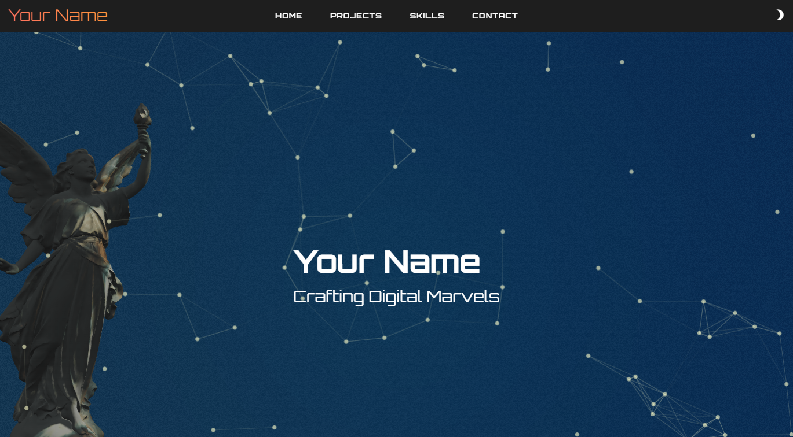

# Nuxt 3 Vuetify Template

This is a Nuxt 3 starter template that comes with the following packages pre-installed:

- **Vuetify** for UI components (`vuetify-nuxt-module`)
- **Three.js** (`three`) for 3D rendering
- **GSAP** (`gsap`) for animations
- **Nuxt Particles** (`nuxt-particles`) for particle effects
- **@mdi/font** for Material Design Icons
- **TypeScript** and **ESLint** configured for a better development experience

Additionally, there is an example of a basic portfolio implementation included.



```
📦components
 ┣ 📂Animation
 ┃ ┣ 📜ModelRender.vue
 ┃ ┣ 📜Particles.vue
 ┃ ┗ 📜TypedText.vue
 ┣ 📂Card
 ┃ ┣ 📜ProjectCard.vue
 ┃ ┗ 📜SkillsCard.vue
 ┣ 📂Form
 ┃ ┗ 📜ContactForm.vue
 ┣ 📂Layout
 ┃ ┣ 📜AppFooter.vue
 ┃ ┗ 📜AppHeader.vue
 ┗ 📂Section
 ┃ ┣ 📜About.vue
 ┃ ┣ 📜Projects.vue
 ┃ ┣ 📜Skills.vue
 ┃ ┗ 📜Timeline.vue
```

These components can be used to build and customize a simple portfolio layout with sections for about, projects, skills, and a timeline.


## Installation

To get started, follow these steps:

1. Clone the repository:

   ```bash
   git clone https://github.com/oooFreaKooo/nuxt-vuetify-template.git
   ```

2. Navigate into the project directory:

   ```bash
   cd nuxt-vuetify-template
   ```

3. Install the dependencies using Yarn:

   ```bash
   yarn
   ```

4. Start the development server:

   ```bash
   yarn dev
   ```

## Build for Production

To build the application for production:

```bash
yarn build
```

After building, you can start the production server:

```bash
yarn start
```

## Linting

To lint your code, run:

```bash
yarn lint
```

To automatically fix linting issues, run:

```bash
yarn lint:fix
```

## Example Portfolio

This template includes an example implementation of a basic portfolio page. You can customize and build upon it to fit your needs.
